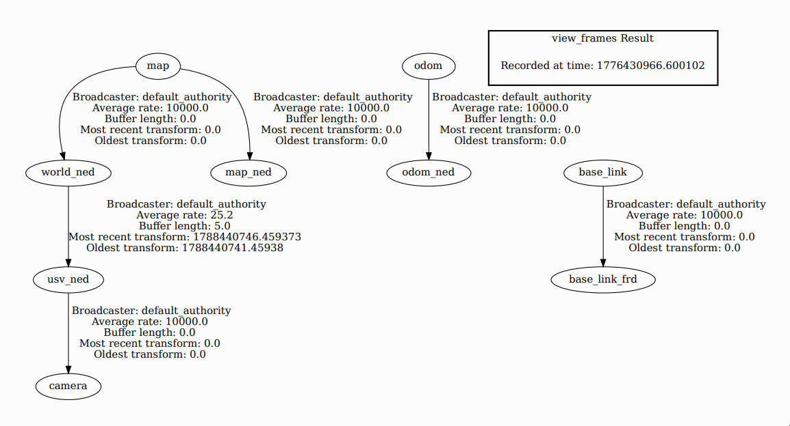
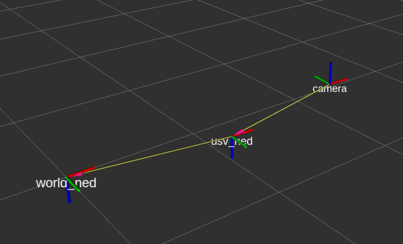

The goal of this package is to unify and simplify the process of handling the reference frames used along with selene. The local ENU reference frame captured in the topic **/ap/pose/filtered** is converted to NED and the position of the camera is defined relative to that NED pose.

